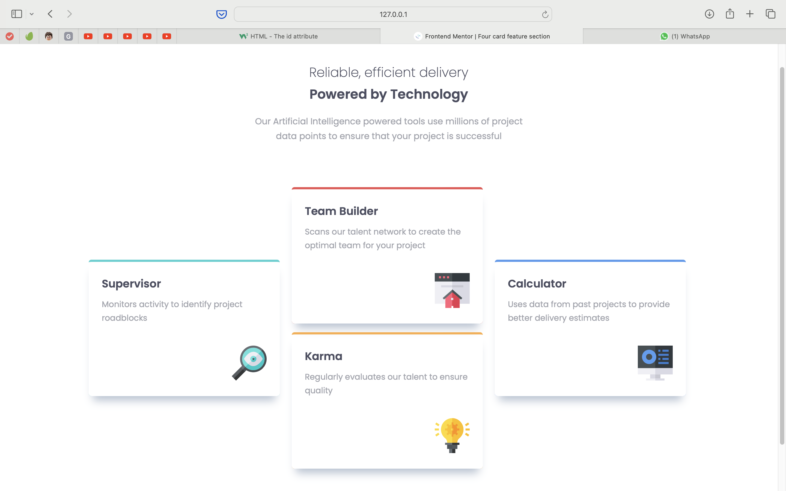
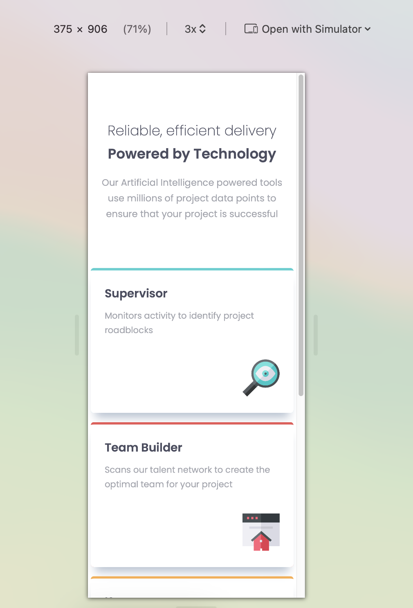

# Frontend Mentor - Four card feature section solution

This is a solution to the [Four card feature section challenge on Frontend Mentor](https://www.frontendmentor.io/challenges/four-card-feature-section-weK1eFYK). Frontend Mentor challenges help you improve your coding skills by building realistic projects. 

## Table of contents

- [Overview](#overview)
  - [The challenge](#the-challenge)
  - [Screenshot](#screenshot)
  - [Links](#links)
- [My process](#my-process)
  - [Built with](#built-with)
  - [What I learned](#what-i-learned)
  - [Continued development](#continued-development)
  - [Useful resources](#useful-resources)
- [Author](#author)
- [Acknowledgments](#acknowledgments)

**Note: Delete this note and update the table of contents based on what sections you keep.**

## Overview

### The challenge

Users should be able to:

- View the optimal layout for the site depending on their device's screen size

### Screenshot

### Links

- Solution URL: [Github repo](https://github.com/mahfolio/four-card-feature-section)
- Live Site URL: [Live view](https://four-card-feature-section-pied-six.vercel.app)

## My process

### Built with

- Semantic HTML5 markup
- CSS custom properties
- Flexbox
- CSS Grid
- Mobile-first workflow

### What I learned

I've learned a lot. I've learned how to start a project, and progress step by step. I've tried to use what I learned so far on both html and css. It was a challenge for me to think about the problem, and find out a solution. I've tried to implement the whole projection on my own, but I got some ideas from Kevin Powell, though. I've tried not to follow him entirely, I wanted to implement the layout especially on my own. Eventually, I've implemented the project as close as I can, but I feel my CSS rules are messy!

### Continued development

I want to hone my skill on layout especially using grid. And also would like to further imrove the layout for the desktop version of this project.

## Author

- Frontend Mentor - [@mahadinfo](https://www.frontendmentor.io/profile/mahadinfo)

## Acknowledgments

I want to thank Kevin Powell for his guideline [@KevinPowell](https://www.youtube.com/@KevinPowell)